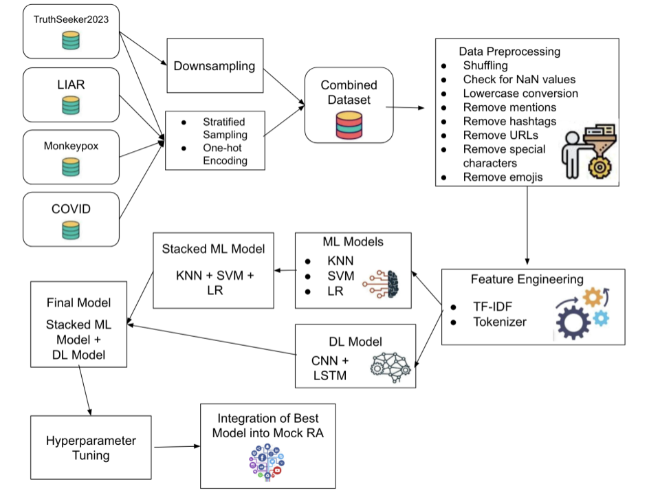
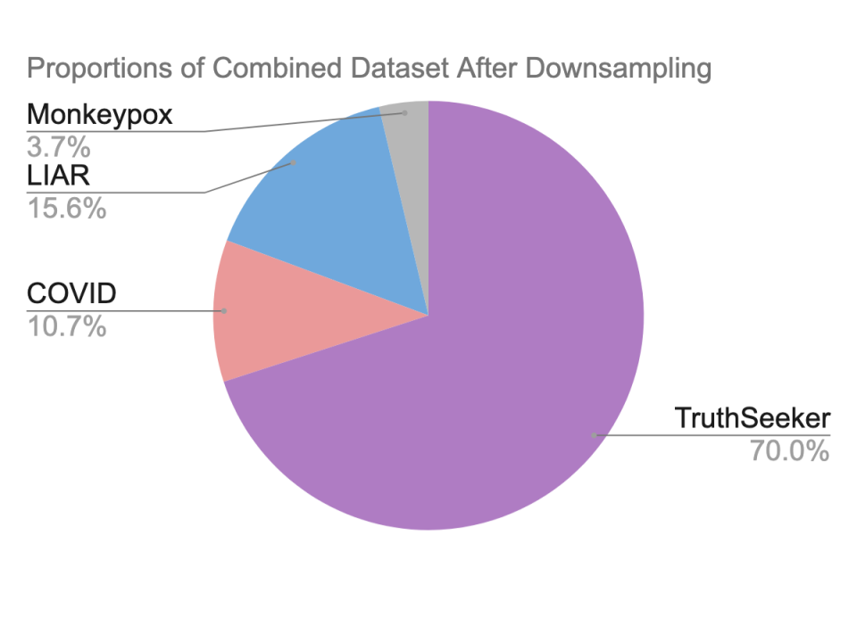
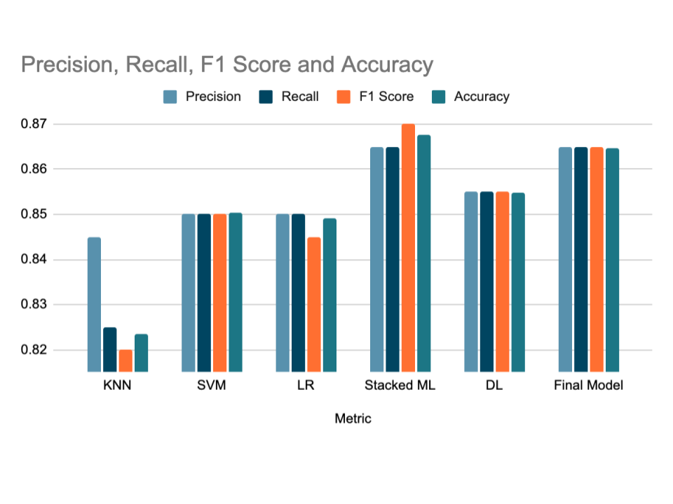
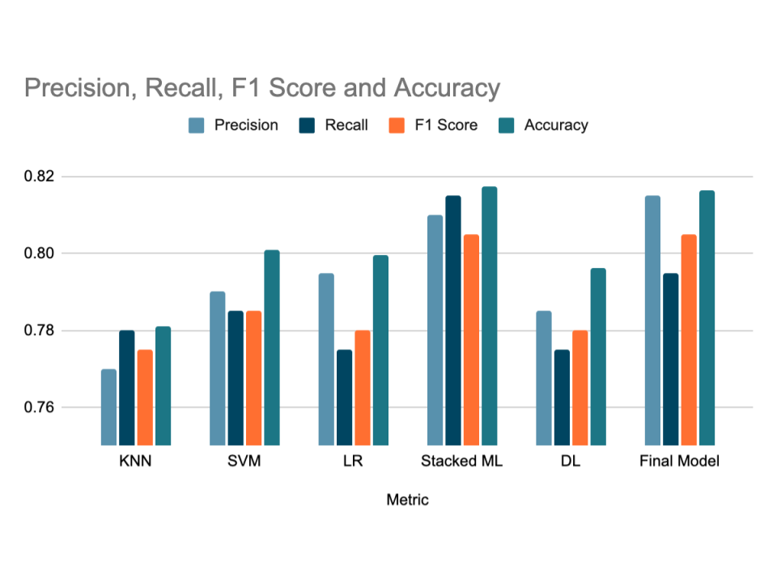

# Misinformation Detection & Social Feed Ranking

This project explores how social media recommendation algorithms can amplify misinformation and tests whether misinformation classification models can be used to reduce that amplification. The project builds machine learning and deep learning models to classify social media content as reliable or misinformation, then integrates the strongest model into a mock Twitter/X-style recommendation pipeline that filters low-reliability content before ranking.

## Project Motivation

Social media platforms often recommend content based on engagement signals such as likes, shares, replies, and popularity. While this can keep users active, it can also amplify misleading or false information when misinformation receives high engagement. This project asks whether a recommendation system could be improved by adding a misinformation detection step before content is ranked and recommended.

The goal was not only to build a classifier, but to connect classification to a platform-level problem: how algorithmic ranking systems can be redesigned to reduce the spread of harmful misinformation.

## Research Question

Can misinformation classification models be integrated into a mock social media recommendation system to filter low-reliability content and reduce misinformation amplification?

## My Role

This was an independent data science and machine learning project. I designed the full project pipeline, reviewed prior research, selected and combined datasets, cleaned and preprocessed text data, engineered features, trained and evaluated multiple models, tuned hyperparameters, compared performance, and integrated the best-performing classifier into a mock social feed-ranking system.

## Data

The project used four publicly available datasets selected for topic diversity and similarity to social media content:

| Dataset | Content Type | Approx. Size | Topic |
|---|---:|---:|---|
| TruthSeeker2023 | Tweets | 180,000+ | Diverse |
| COVID-19 Fake News Detection | Social media posts/articles | 10,700 | COVID-19 |
| Monkeypox Misinformation | Tweets | 5,266 | Monkeypox |
| LIAR | Political/fact-checked statements | 12,800 | Diverse |

After preprocessing, downsampling, balancing, and combining the datasets, the final dataset included 57,446 rows: 28,896 labeled as true information and 28,550 labeled as misinformation.

Raw datasets are not included in this repository because they come from separate public sources and may be large. The notebook documents the data preparation and modeling workflow.

## Methods

The project followed this general pipeline:

1. Load four public misinformation/fake-news datasets
2. Standardize each dataset into text and label columns
3. Convert labels into binary classes:
   - `0` = true/reliable information
   - `1` = misinformation/false information
4. Balance and combine datasets using stratified sampling
5. Clean text by removing:
   - missing values
   - URLs
   - mentions
   - hashtags
   - emojis
   - special characters
6. Engineer text features using:
   - TF-IDF vectorization for traditional machine learning models
   - tokenization for the deep learning model
7. Train and tune multiple classifiers
8. Compare models using standard evaluation metrics
9. Integrate the best-performing model into a mock recommendation pipeline

## Models Tested

The project compared several machine learning, deep learning, and hybrid approaches:

- K-Nearest Neighbors
- Support Vector Machine
- Logistic Regression
- Stacked machine learning ensemble: KNN + SVM + Logistic Regression
- CNN + LSTM deep learning model
- Final hybrid stacked model combining the stacked ML model and CNN + LSTM model

## Evaluation Metrics

Models were evaluated using:

- Accuracy
- Precision
- Recall
- F1 score
- Training time
- Prediction time

Hyperparameter tuning was performed using GridSearch for traditional machine learning models and KerasTuner for the deep learning model.

## Key Results

The stacked machine learning model performed best overall, achieving approximately 86.75% accuracy after data cleaning and hyperparameter tuning. The CNN + LSTM model and the final hybrid model also performed strongly, with accuracies in the mid-80% range.

| Model | Accuracy After Tuning |
|---|---:|
| KNN | 82.35% |
| SVM | 85.03% |
| Logistic Regression | 84.92% |
| Stacked ML Model | 86.75% |
| CNN + LSTM | 85.47% |
| Final Hybrid Model | 86.47% |

The results suggest that misinformation classifiers can be used as a filtering layer before social media content is ranked and recommended.

## Recommendation System Integration

After comparing model performance, I integrated the best-performing classifier into a mock Twitter/X-style recommendation pipeline. The mock recommender included basic components such as:

- candidate fetching
- relevance scoring
- ranking based on engagement-style signals
- heuristic filtering
- misinformation filtering

The misinformation classifier was added as a preprocessing step. Content predicted to be misinformation was filtered out before the remaining posts were passed into the ranking system.

## Figures

### Methodology Flow

### Dataset Composition After Downsampling

### Model Comparison After Data Cleaning and Hyperparameter Tuning

### Model Comparison Before Data Cleaning and Hyperparameter Tuning

## Tools Used

- Python
- Pandas
- NumPy
- scikit-learn
- TensorFlow/Keras
- KerasTuner
- Matplotlib
- Google Colab

## Files in This Repository

- `misinformation_feed_ranking_pipeline.ipynb`  
  Full project notebook containing the data cleaning, preprocessing, feature engineering, model training, evaluation, tuning, and mock recommendation pipeline.

- `project_report.pdf`  
  Final written report explaining the research motivation, literature review, methodology, results, discussion, limitations, and conclusion.

- `requirements.txt`  
  Main Python packages used in the project.

- `figures/`  
  Visuals from the final report.

## Limitations

This project uses binary misinformation labels, even though real-world information quality often exists on a spectrum. The models also rely primarily on text content and do not incorporate user metadata, network context, source credibility, or temporal signals. In addition, the mock recommendation pipeline is a simplified version of a real platform recommender and is intended as a proof of concept rather than a production-ready system.

## Future Improvements

Future work could improve this project by:

- using larger platform-specific datasets
- incorporating source and user-level credibility signals
- classifying information reliability on a spectrum instead of as a binary label
- adding metadata such as likes, shares, time, author history, or network position
- testing the filtering system in a more realistic recommendation environment
- improving model explainability and fairness checks

## Project Takeaway

This project shows how misinformation detection can be connected to recommendation system design. Rather than treating misinformation classification as a standalone task, the project demonstrates how a classifier could become part of a larger platform-governance pipeline designed to reduce the amplification of low-reliability content.
